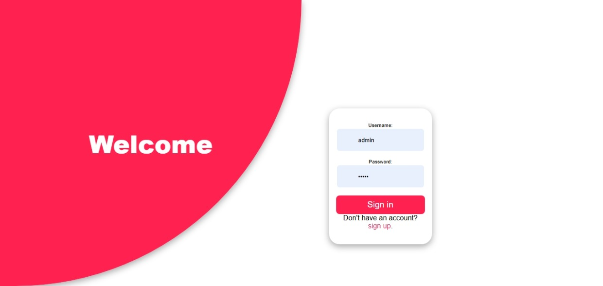
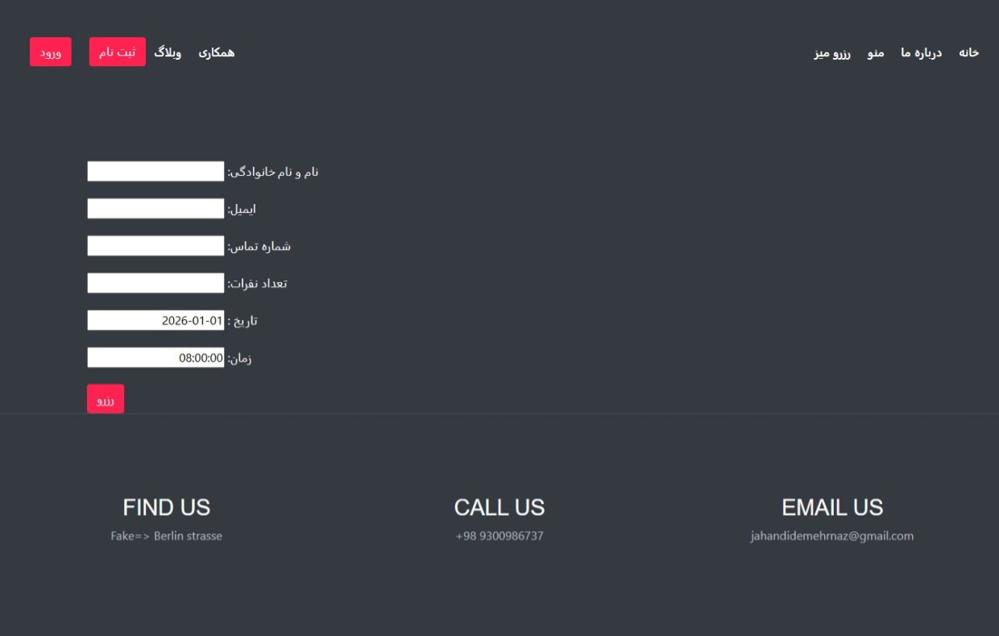
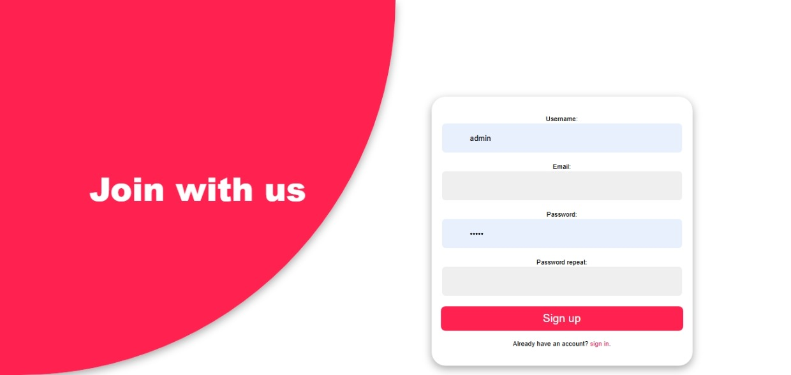

# Iranisches Restaurant – Webseite

Dieses Projekt ist eine Webseite für ein iranisches Restaurant, die ich mit Django gemacht habe.  
Man kann die Gerichte sehen, nach Essenstyp filtern und Details zu jedem Gericht anschauen.

## Was die Seite kann:

- Benutzerregistrierung und Anmeldung  
- Tischreservierung (Name, Datum, Uhrzeit, Anzahl Personen)  
- Menü ansehen und filtern mit Buttons (z. B. Salat, iranisches Essen, Fast Food)  
- Für jedes Essen gibt es eine Detailseite mit Bild und Beschreibung  
- Ich habe das Design mit HTML und CSS selbst gemacht, die Seite ist auch responsive

## Welche Technik ich benutzt habe:

- Python und Django für den Server  
- HTML und CSS für das Design  
- Etwas Bootstrap  
- SQLite als Datenbank

